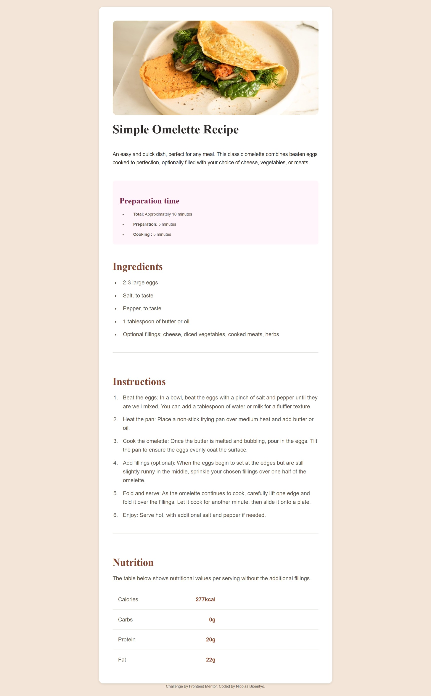

# Frontend Mentor - Recipe page solution
## Table of contents

- [Overview](#overview)
  - [Screenshot](#screenshot)
  - [Links](#links)
- [My process](#my-process)
  - [Built with](#built-with)
  - [What I learned](#what-i-learned)
  - [Useful resources](#useful-resources)
- [Author](#author)


## Overview

This is my solution to the [Recipe page challenge on Frontend Mentor](https://www.frontendmentor.io/challenges/recipe-page-KiTsR8QQKm). Frontend Mentor challenges help me improve my coding skills by building realistic projects. 


### Screenshot



### Links

- Solution URL: [Repo URL](https://github.com/Nicolas-Ohlin/recipe-page-main)
- Live Site URL: [Live URL](https://nicolas-ohlin.github.io/recipe-page-main/m)

## My process
- Analyse the page structure
- Write HTML code according to the found structure
- Style the page with pure CSS

### Built with

- HTML5 
- CSS 
- Flexbox
- Responsivness

### What I learned

During the challenge i appreciate the way of displaying elements according to the screen size using basic media queries in CSS!

To see how you can add code snippets, see below:

```css
@media (max-width: 375px) {
  body { padding: 0; }

  .recipe-container {
    max-width: 600px;
    margin: 0 auto;
    border-radius: 0;
    overflow: visible;
    padding-top:0 ;
  }

  .image-container {
    width: 100vw;
    height: auto;
    margin-left: calc(50% - 50vw);
    margin-right: calc(50% - 50vw);
    border-radius: 0;
    overflow: hidden;
  }

  .image-container img {
    width: 100%;
    border-radius: 0;
  }
}
```

- [resource 1](https://developer.mozilla.org/fr/docs/Web/HTML/Reference/Elements/hr) 
- [resource 2](https://developer.mozilla.org/en-US/docs/Web/HTML/Reference/Elements/table) 

## Author

- Website - [Nicolas Bibentyo](https://github.com/Nicolas-Ohlin)
- Frontend Mentor - [@Nicolas-Ohlin](https://www.frontendmentor.io/profile/Nicolas-Ohlin)
